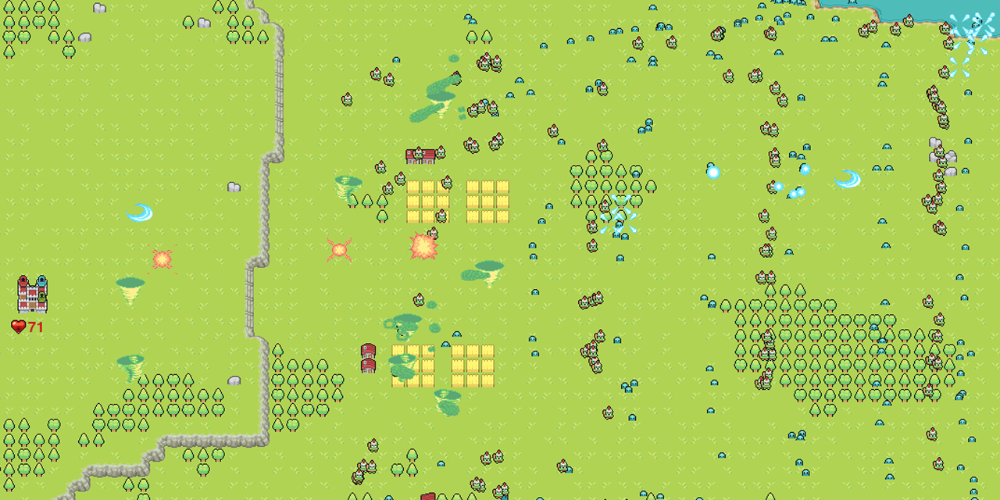

# Siege of Westhold

You are the last Circle of Mages. Protect Westhold at all costs! Randomized upgrades, build paths, and more enemy variants in development!

## Playable Alpha Build

1. Download and extract 'Siege_of_Westhold_RELEASE_alpha.rar'
2. Run 'SoW_alpha.exe' 

*This build demonstrates the core gameplay loop. Enemy numbers increase over-time but player progression system is currently in development.*

### Mages

**Fire Mage** - shoots fireballs at the mouse pointer, damaging the first enemy hit
 **Light Mage** - shoots blades of light that pierce through all enemies
 **Wind Mage** - conjures tornadoes with limited range but pushes enemies back
 **Shock Mage** - shoots energy balls which bounce to one other enemy
